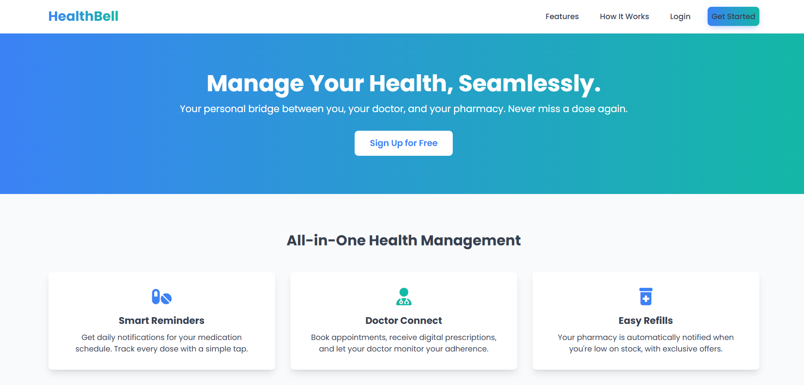

# HealthBell - A Personal Health Management Platform

HealthBell is a modern web application designed to create a seamless connection between patients, doctors, and pharmacies. It aims to improve medication adherence, streamline appointment scheduling, and simplify prescription management through a clean, intuitive, and role-based interface.

**Live Application:** [**healthbell.netlify.app**](https://healthbell.netlify.app)

_
A screenshot of the HealthBell application homepage.
_

---

## Core Features

### For Patients

- **Smart Medication Tracker:** A daily checklist to track medication intake. The system automatically decrements pill stock and provides a clear history.
- **Digital Prescriptions:** View all prescriptions assigned by your doctor in an organized list.
- **Appointment Booking:** View doctor availability on a 7-day calendar and book appointments in available slots.
- **Unified Notification Center:** Receive real-time alerts for low medication stock, appointment confirmations, and special offers from your pharmacy.

### For Doctors

- **Digital Prescription Management:** Easily create and assign detailed, multi-medicine prescriptions to registered patients.
- **Schedule Management:** Define weekly availability through an intuitive time-slot grid.
- **Appointment Dashboard:** View and manage incoming appointment requests and see a clear agenda of upcoming confirmed appointments.
- **Patient Adherence Monitoring:** Access a powerful report for any patient showing a detailed history of both taken and missed doses to better guide treatment.

### For Pharmacies

- **Automated Low-Stock Alerts:** Receive automatic notifications when a patient's medication stock runs low, enabling proactive patient care.
- **Direct Patient Offers:** Send refill reminders and special offers directly to the patient's notification center in response to a low-stock alert.

---

## Technology Stack

This project was built using a modern, serverless architecture.

- **Frontend:**

  - HTML5, CSS3, JavaScript (ES6+)
  - Tailwind CSS (CDN) for utility-first styling.
  - Font Awesome for icons.

- **Backend & Database:**

  - **Firebase:** Backend-as-a-Service (BaaS) platform.
    - **Firebase Authentication:** For secure email/password user registration and login.
    - **Firestore Database:** A NoSQL, real-time database for all application data.

- **Deployment:**
  - **Netlify:** For continuous deployment and hosting.

---

## Local Development Setup

1.  **Clone the repository:** `git clone https://github.com/ahnaftahmid19/HealthBell`
2.  **Create a Firebase project:** Enable **Authentication** (Email/Password) and **Firestore** (Test Mode).
3.  **Configure:** Copy your `firebaseConfig` object from your Firebase project settings into `firebase-config.js`.
4.  **Run:** Serve the project from a local server (e.g., using the VS Code Live Server extension) to handle ES6 modules.

**Note on Firestore Indexes:** The application uses complex queries that require composite indexes. The browser console will provide direct links to create these in Firebase as you navigate the app. This is expected behavior.
